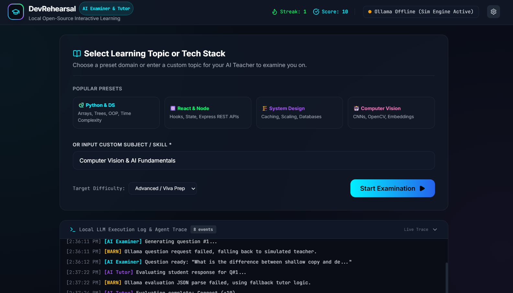

*This is a submission for the [Hacktoberfest Weekend Challenge: Build for a Friend](https://dev.to/challenges/hacktoberfest-weekend-2026-10-01)*

## What I Built


### Frontend Dashboard Preview



**DevRehearsal** is a 100% local, voice-enabled AI Oral Examiner & Technical Tutor designed to help students and developers rehearse project defenses, viva exams, and technical hackathon presentations.

I built this specifically for my classmate and friend who was feeling anxious about answering unpredictable technical questions during upcoming college project viva exams and hackathon presentations.

### The Problem It Solves:
* **Presentation Anxiety:** Practicing alone is ineffective because you can't anticipate tough questions.
* **Lack of Constructive Feedback:** Standard practice doesn't pinpoint *why* an answer was inadequate or show how to structure an ideal technical response.
* **Privacy & Cost Concerns:** Sharing proprietary project code or early hackathon ideas with commercial cloud APIs is risky, and API costs add up during repeated rehearsal loops.

---

### Video Demo
[Watch the DevRehearsal Demo Video](YOUR_DEMO_VIDEO_LINK_HERE)

---

## Requirements & Prerequisites

Before running the project, make sure you have the following installed on your machine:

1. **System Requirements:**
   * **Operating System:** Windows 10/11, macOS, or Linux.
   * **RAM:** Minimum 8 GB (16 GB recommended for smooth local inference).
   * **Storage:** 4–8 GB free disk space for open-weight AI models.

2. **Software Prerequisites:**
   * **Git:** Installed on your computer ([Download Git](https://git-scm.com/)).
   * **Ollama:** Installed and running locally ([Download Ollama](https://ollama.com/)).
   * **Modern Web Browser:** Google Chrome, Microsoft Edge, or Mozilla Firefox (with Web Speech API enabled for voice input/output).

---

## How to Clone and Run the Project

Follow these steps to run **DevRehearsal** on your local machine:

### Step 1: Start Ollama & Pull the AI Model
Open your terminal or Command Prompt and download an open-weight model (e.g., Llama 3.2):
```bash
ollama pull llama3.
```

Ensure Ollama is running in the background (you should see the Ollama icon in your taskbar).

## Step 2: Clone the Repository
Clone the project repository to your local machine using Git:
```
git clone [https://github.com/YOUR_GITHUB_USERNAME/DevRehearsal.git](https://github.com/YOUR_GITHUB_USERNAME/DevRehearsal.git)
cd DevRehearsal
```
